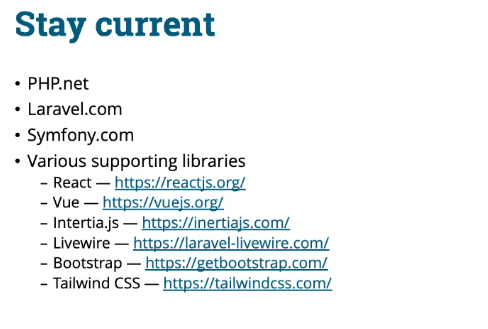
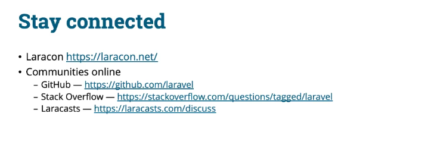

# 🧭 Güncel Kalmak ve Dahil Olmak

Laravel güvenli kodlama yolculuğun için birkaç düşünce ve sonraki adımlarla bu bölümü tamamlayalım. Bu videoda, güncel kalabilmen ve toplulukla bağlantıda olabilmen için bazı kaynakları paylaşacağım. Laravel projenin, yalnızca Laravel framework’ünden çok daha fazlası olduğunu anlamak önemli ve sanırım artık bunu fark ettin. Genel olarak bir Laravel uygulamasından bahsederken, öncelikle bunun PHP üzerinde inşa edildiğini unutmayalım. PHP’de nelerin yeni olduğunu görmek ve PHP ile bağlantıda kalmak için resmi PHP web sitesine — php.net — göz atabilirsin. Uygulamalarımda programlama yaparken kullanılabilir fonksiyonları ve PHP’deki yenilikleri bilmek için hâlâ neredeyse her gün bu siteyi referans alıyorum.

Ve neredeyse her gün başvurduğum bir diğer şey de resmi Laravel web sitesi — laravel.com. Burada en güncel sürümlerin yanı sıra kapsamlı dokümantasyona ulaşabilirsin.

Bazı insanlardan, dokümantasyon okumayı sevdiğimi ve baştan sona okuduğumu garip bulduklarını duydum. Ama bunu yapmasan bile, Laravel’in nasıl çalıştığını öğrenmek için mutlaka bu siteye göz at. Laravel projesini oluştururken sahip olduğun tüm seçenekleri burada görürsün. Symfony, Laravel’in üzerine kurulu olduğu ana platformlardan biridir. Genellikle Symfony component’leriyle doğrudan etkileşime girmezsin, ancak Laravel’in neleri uygulamayı seçtiğini ve hatta kendi projen için bu işlevleri nasıl genişletebileceğini öğrenmen mümkün.

Ve unutma, frontend tarafını oluşturan daha fazla framework ve araç seti de var. React, Vue veya Inertia JS JavaScript framework ve kütüphaneleri, uygulamanın tam teşekküllü katmanını oluşturur.

Livewire, frontend ve backend arasındaki boşluğu doldurmaya yardımcı olan topluluk tabanlı bir projedir. Bunu, kimlik doğrulama kitlerinden birinde de kullanıyor olabilirsin. Stil tarafında ise Bootstrap CSS ve/veya Tailwind CSS sitelerine göz atmayı unutma; eğer bu implementasyonlardan birini tercih ediyorsan harika başvuru kaynaklarıdır. Ancak hepsinin ortak bir özelliği var: bir güncelleme mekanizmasına sahip olmaları. Twitter hesapları veya sürüm mailing list’leri gibi. Özellikle güvenlik güncellemeleri olduğunda bundan haberdar olmak için bu kaynaklara abone olmanı öneririm.

Toplulukla bağlantıda kalmak için yüz yüze veya hibrit etkinlikler ve çevrimiçi topluluklar bulunuyor. Laracon, yıla ve global sağlık durumuna bağlı olarak yüz yüze veya sanal bir konferans olarak düzenlenir.

Birçok kaliteli konuşma, demo ve yeni özelliklere dair içgörüler içerir. Burada birçok topluluk üyesini bulabilirsin, Laravel güvenlik video kursu eğitmeni de dahil! Çevrimiçi katılım için Laravel’in GitHub sayfasına göz atabilirsin; Laravel’i oluşturan birçok proje burada barındırılıyor. Ticket’larla ve pull request incelemeleriyle ilgilenmek, Laravel’in nasıl çalıştığını anlamanın ve güvenlik düzeltmelerine güncel kalmanın harika bir yoludur. Stack Overflow da Laravel tabanlı soru-cevap konusunda güçlü bir topluluğa sahiptir.

Son olarak Laracast, büyük bir topluluğa dönüştü. Başlangıçta sadece bir video kurs platformuyken, artık çok çeşitli ve aktif bir topluluğu da barındırıyor.

Tartışma forumlarında pek çok soru soruluyor ve cevaplanıyor.

Ve hepsi bu kadar, öğrenme yolculuğunu tamamladığın için tebrikler. Laravel’i güvenli şekilde programlama konusunda güzel bir kavrayış edindiğini umuyorum, ancak bundan sonrası için güncel kalmak sana düşüyor. Dahil ol, topluluğunla iletişime geç, güncellemeleri takip et.

Benimle kaldığın için teşekkür ederim. Başka soruların olursa, bu platformdaki güncel bio ve bağlantılarıma göz at ve bir soru sormak veya selam vermek için bana bir not gönder.

Hepsi bu kadar, hoşça kal.

